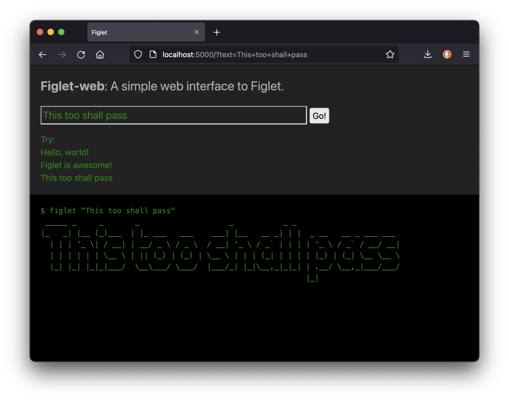

# Figlet-web

Figlet-web is a simple web interface to the figlet command.



## Requirements

You need have the following software installed to run this webapp.
The instructions below assume that you using Ubuntu 22.04.

**figlet**

You can install figlet using:

```
$ apt-get update
$ apt-get install -y figlet
```

**Python 3**
Python 3 is installed by default on Ubuntu 22.04.

## How to run

**Step 1:** Clone the git repo

```
$ git clone https://github.com/anandology/figlet-web
...

$ cd figlet-web
```

**Step 2:** Setup virtualenv

```
$ python3 -m venv venv
...

$ source venv/bin/activate
```

**Step 3:** Install python dependencies

```
$ pip install -r requirements.txt
...
```

**Step 4:** Run the webapp

```
$ gunicorn -b 0.0.0.0:8000 webapp:app
...
 Listening at: http://0.0.0.0:8000
...
```

The web app is running locally. You can access it from your browser by visiting <http://your-ip:8000/>
